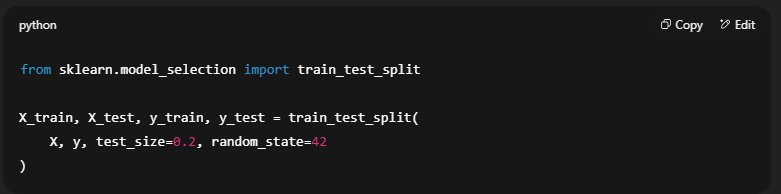

# ML-Foundations

train_test_split is one of the most important steps in ML, let’s break it down very clearly.

The Problem it Solves

If you train your model on the entire dataset and then check accuracy on the same data, the model can just memorize answers instead of actually learning patterns.
👉 That’s called overfitting.

So we need a way to test the model on new, unseen data (like in real life).

The Solution → train_test_split

It splits your dataset into 2 parts:

Training set (X_train, y_train):

Used by the model to learn patterns.

Usually ~70–80% of the data.

Testing set (X_test, y_test):

Completely unseen during training.

Used only to check how good the model is.

Usually ~20–30% of the data.

Example from your code

X → features (inputs).

y → labels (outputs).

test_size=0.2 → 20% data goes to test set, 80% to training.

random_state=42 → fixes randomness so you always get the same split (for reproducibility).

Visually

If you had 100 rows of housing data:

80 rows → Training set

20 rows → Testing set

Why this matters

Training accuracy tells: “How well did I learn this dataset?”

Testing accuracy tells: “How well will I generalize to new data?”

👉 Testing accuracy is the real measure of performance.

